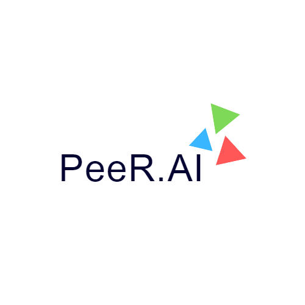

# Peer.AI - Empower Your Browsing Experience with Voice Navigation, Q&A, and Compression!

Peer.AI is a game-changing Chrome extension that revolutionizes how you interact with the web. Effortlessly manage tabs and bookmarks using voice commands, freeing up your hands and making browsing tasks more efficient. With voice search, find information faster than ever before, eliminating the need for typing. Engage in interactive Q&A sessions with our intelligent ChatGPT, getting instant answers to your queries. Additionally, enjoy the convenience of requesting compressed and summarized web pages in a speak louder mode. VoiceWave transforms your Chrome experience, making it easier, safer, and more accessible.
## Features

- **Voice Navigation:**: Seamlessly navigate through tabs and bookmarks using intuitive voice commands.

- **Voice Search:** Conduct web searches effortlessly by speaking your queries instead of typing them.

- **Q&A Session with ChatGpt:** Engage in interactive conversations with ChatGpt, an AI-powered chatbot, to ask questions and receive real-time answers.

- **Compressed Webpage Summaries:** Request concise summaries of webpages to quickly grasp key information without reading through lengthy content.

- **"Speak Louder" Mode:** Amplify the voice output of Peer.AI to ensure clear and audible navigation, search results, summaries, and conversations.

- **Tab Management:** Efficiently organize and manage your open tabs, enabling a clutter-free browsing experience.

- **Bookmark Management:** Easily save, categorize, and access bookmarks to keep track of your favorite websites.

- **Enhanced Accessibility:** Enable hands-free browsing and interact with Peer.AI even in noisy environments using voice commands.

- **Streamlined Browsing Experience:** Combine the power of voice navigation, search, Q&A sessions, and compressed summaries to enhance productivity and efficiency.

- **User-Friendly Interface:** Enjoy a user-friendly interface that provides easy access to all the features and settings of the Peer.AI extension.

By incorporating these features, Peer.AI aims to revolutionize your browsing experience by offering convenient voice-based navigation, efficient search and information retrieval, interactive conversations, and enhanced accessibility, all in one powerful Chrome extension.

## Demo

## Installation 
1. Open the Chrome web browser.
2. clone the repo to your local system
3. run the command in the terminal of your local system to clone the repo - git clone git@github.com:sd012gfhkhhvh/Peer.AI.git
4. run npm i command to install all the dependencies
5. open chrome -> Extention manager -> activate developer mode
6. Click Load unpacked and navigate to the download directory
7. upload the dist file
8. Pin it
9. Good to go.

## Usage

1. Voice Navigation: With Peer.AI, you can navigate through your tabs and bookmarks using voice commands, eliminating the need for manual clicking and scrolling. It provides a hands-free and intuitive browsing experience.

2. Voice Search: Peer.AI's voice search functionality allows you to search the web effortlessly using your voice. Simply speak your query, and Peer.AI will fetch relevant search results, saving you time and effort.

3. Q&A Session with ChatGpt: Engage in interactive Q&A sessions with ChatGpt, an AI-powered chatbot. Ask questions, seek insights, and receive real-time answers, making information retrieval more conversational and engaging.

4. Compressed Webpage Summaries: Peer.AI enables you to request concise summaries of webpages on-demand. Get the key points and highlights of an article or webpage without the need to read through lengthy content, providing a quick overview of the information.

5. "Speak Louder" Mode: Peer.AI offers a "speak louder" mode, ensuring clear and audible voice output even in noisy environments. This feature enhances accessibility and allows you to comfortably interact with the extension in various settings.

6. Tab and Bookmark Management: Peer.AI streamlines your browsing experience by providing easy-to-use tools for managing tabs and bookmarks. Organize and access your browsing sessions efficiently, reducing clutter and improving productivity.

7. Overall, Peer.AI revolutionizes your browsing experience by leveraging voice commands, intelligent search capabilities, interactive Q&A sessions, compressed webpage summaries, and user-friendly tab management. It aims to enhance convenience, efficiency, and accessibility, making browsing a seamless and engaging activity.
## Contributions

Contributions and feedback are welcome! If you encounter any issues or have suggestions for improvement, please [create an issue](https:///github.com/sd012gfhkhhvh/Peer.AI).

## License

This project is licensed under the [MIT License](LICENSE).

## Contact

For any inquiries, please contact sohamdas.nest@gmail.com
